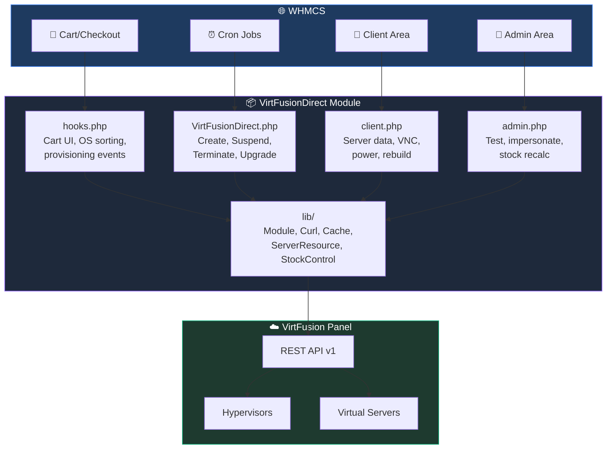
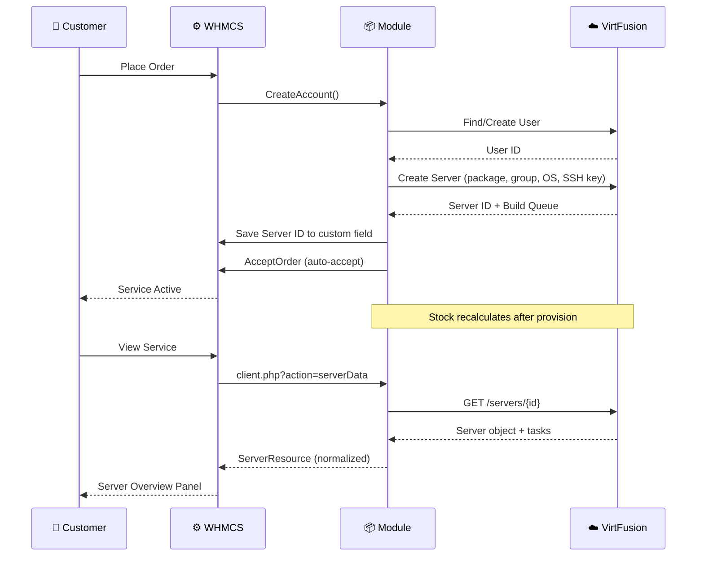
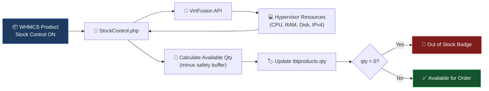

<h1 align="center">
  <br>
  🚀 VirtFusion Direct Provisioning Module for WHMCS
  <br>
  <sub>FlashRDP Fork</sub>
</h1>

<p align="center">
  <a href="https://github.com/EZSCALE/virtfusion-whmcs-module"></a>
  <a href="LICENSE.md"></a>
  
  
  
</p>

<p align="center">
  A comprehensive WHMCS provisioning module for <a href="https://virtfusion.com">VirtFusion</a> that enables automated VPS server provisioning, management, and client self-service directly from WHMCS.
</p>

---

## 🙏 Attribution

This repository is a customized fork of the excellent open-source **[VirtFusion WHMCS Module](https://github.com/EZSCALE/virtfusion-whmcs-module)** created and maintained by **EZSCALE**. We are grateful for their work in building and maintaining the original module.

> [!NOTE]
> This fork is maintained primarily for **FlashRDP's** internal WHMCS/VirtFusion infrastructure. Features, fixes, and architectural decisions are implemented from FlashRDP's perspective and may differ from upstream behavior. Neither the original author (EZSCALE) nor VirtFusion officially maintains or supports FlashRDP-specific modifications. For the general-purpose module, please refer to the [original upstream project](https://github.com/EZSCALE/virtfusion-whmcs-module).

---

## ✨ FlashRDP Enhancements

Features exclusive to this fork, not present in the upstream EZSCALE module:

| Enhancement | Description |
|:---:|---|
| 🎨 **Premium Checkout UI** | Replaced default flexbox pills with a modern **5-column CSS grid** of square cards (3-column on mobile) |
| 📊 **Smart OS Sorting** | Priority-based sorting pushes Windows, Ubuntu, Debian, CentOS, AlmaLinux to the top |
| ⚡ **Queue Task API** | Added `getQueueTask()` endpoint for tracking background provisioning and rebuild jobs |
| 🔗 **Task State Injection** | Background task states injected into `ServerResource` for native client-area visibility |

### OS Priority Order

```
┌──────────┐ ┌──────────┐ ┌──────────┐ ┌──────────┐ ┌──────────┐
│          │ │          │ │          │ │          │ │          │
│ Windows  │ │  Ubuntu  │ │  Debian  │ │  CentOS  │ │ AlmaLinux│
│    #1    │ │    #2    │ │    #3    │ │    #4    │ │    #5    │
│          │ │          │ │          │ │          │ │          │
└──────────┘ └──────────┘ └──────────┘ └──────────┘ └──────────┘
  ────────── Remaining OS families (alphabetical) ──────────
                    "Other" always last
```

### Fork vs. Upstream Comparison

| Feature | Upstream (EZSCALE) | This Fork (FlashRDP) |
|---|:---:|:---:|
| OS Selection Layout | Flexbox pills | ✅ 5-column CSS grid |
| Mobile OS Layout | 2-column flex | ✅ 3-column responsive grid |
| OS Sort Order | Alphabetical | ✅ Priority-based |
| Queue Task API | ❌ | ✅ `getQueueTask()` |
| Task State in ServerResource | ❌ | ✅ Injected |
| VirtFusionDns addon | ✅ Included | ❌ Removed (separate concern) |
| API docs folder | ✅ Included | ❌ Removed (reduces footprint) |
| Install script | ✅ Included | ❌ Removed (submodule-based) |

---

## 📋 Requirements

| Requirement | Version | Notes |
|:---|:---|:---|
| 🖥️ **VirtFusion** | v1.7.3+ | Tested against **v7.0.0 Build 9**. v6.1.0+ for VNC; v6.2.0+ for resource modification |
| ⚙️ **WHMCS** | 8.x or 9.x | Tested against **WHMCS 9.0.3** |
| 🐘 **PHP** | 8.2+ (WHMCS 9.x) | With cURL extension enabled |
| 🔒 **SSL** | Valid certificate | Required on the VirtFusion panel |

**Required API token permissions:**
- Server management (create, read, update, delete, power, build)
- User management (create, read, reset password, authentication tokens)
- Package and template read access
- Network management (if using IP management features)

---

## 🏗️ Architecture



---

## 🔄 Provisioning Flow



---

## 📦 Features

<details>
<summary><h3>🖥️ Server Provisioning</h3></summary>

- Automatic server creation with VirtFusion user account linking
- Server suspension, unsuspension, and termination
- Package/plan upgrades and downgrades
- Configurable options mapping for dynamic resource allocation (CPU, RAM, disk, bandwidth, network speed)
- **Dry run validation** - Test server creation parameters before provisioning
- Automatic memory unit conversion (GB to MB for values < 1024)

</details>

<details>
<summary><h3>👤 Client Area - Server Management</h3></summary>

| Feature | Description |
|---|---|
| **Server Overview** | Real-time server info with status badge, location flag, OS template name, and lifetime chips |
| **VNC Console** | Browser-based noVNC viewer through same-origin authenticated route; wss token rotates on every open |
| **Maintenance Banner** | Yellow alert when the hypervisor is in maintenance mode |
| **Traffic Chart** | Last 12 months of bandwidth usage (rx + tx) as side-by-side monthly bars |
| **Live Stats** | CPU, memory, and disk I/O from VirtFusion's libvirt introspection, auto-refreshing every 30s |
| **Filesystem Usage** | Per-mount usage rows from qemu-guest-agent with progress bars and warning thresholds |
| **Power Management** | Start, restart, graceful shutdown, and force power off |
| **Control Panel SSO** | One-click login to VirtFusion panel |
| **Server Rebuild** | Reinstall with any available OS template |
| **Password Reset** | Reset VirtFusion panel login credentials |
| **IP Management** | IPv4 + IPv6 listed inline with per-address copy buttons |
| **Resources Panel** | Memory, CPU, storage, traffic allocation with usage bars |
| **Screenshot Mode** | Masks IPs, hostnames, and sensitive inputs for safe screen-sharing |
| **Self-Service Billing** | Credit balance display, usage breakdown, and credit top-up |
| **Section Navigation** | "On This Page" sidebar with smooth-scroll jump-links to every visible panel |

</details>

<details>
<summary><h3>🔧 Admin Area</h3></summary>

| Feature | Description |
|---|---|
| **Test Connection** | Verify API connectivity from WHMCS |
| **Server Data Display** | Live server information from VirtFusion |
| **Admin Impersonation** | Log into VirtFusion panel as server owner |
| **Server ID Management** | Editable Server ID for manual adjustments |
| **Server Object Viewer** | Full JSON response from VirtFusion API |
| **Validate Server Config** | Dry run server creation to check configuration |
| **Update Server Object** | Refresh cached server data from VirtFusion |

</details>

<details>
<summary><h3>🛒 Ordering Process</h3></summary>

- OS template card gallery with accordion categories, search, and brand icons (FlashRDP: 5-column grid)
- SSH key selection dropdown with option to paste a new public key
- **SSH Ed25519 key generator** - Client-side keypair generation using Web Crypto API
- Checkout validation ensuring OS selection before order placement
- **Resource sliders** - Configurable option dropdowns replaced with interactive range sliders
- Compatible with all WHMCS order form templates
- **Order auto-accept** - Paid orders auto-accept after successful provision (idempotent)

</details>

<details>
<summary><h3>📊 Stock Control (Dynamic Inventory)</h3></summary>



- **Live-capacity math** from real hypervisor resources
- **Event-driven refresh** after every provision/termination + 2-hour cron safety net
- **Per-product safety buffer** (default 10%) reserves headroom
- **Fail-safe** under API outages (qty stays unchanged, not zeroed)
- **Admin recalc on demand** via `admin.php?action=stockRecalculate`

</details>

<details>
<summary><h3>🔄 Usage Tracking &amp; Resource Modification</h3></summary>

**Usage Tracking:**
- Automated bandwidth sync via WHMCS daily cron
- Disk usage sync updated automatically

**Resource Modification:**
- In-place modification of server resources (memory, CPU cores, traffic)
- No server rebuild required for resource changes
- Package change applies individual resource modifications from configurable options

**Backup Management:**
- Assign/remove backup plans to servers via VirtFusion API

</details>

<details>
<summary><h3>💰 Self-Service Billing</h3></summary>

- Credit balance display and top-up from client area
- Usage breakdown reporting
- Auto top-off via WHMCS cron when credit falls below threshold
- Self-service mode configurable per product (Hourly, Resource Packs, or Both)

</details>

<details>
<summary><h3>🌐 Reverse DNS (Optional PowerDNS Addon)</h3></summary>

- **Automatic PTR sync** on server create, rename, and terminate
- **Client-editable rDNS** panel in the service overview
- **Forward-confirmed reverse DNS (FCrDNS)** validation
- **IPv4 + IPv6** support (IPv6 nibble-reversal, `.ip6.arpa` zones)
- **RFC 2317 classless delegation** support
- **Opt-in** via companion WHMCS addon module

</details>

---

## ⚙️ Configuration

### Server Setup

In WHMCS Admin under **Configuration > System Settings > Servers**:

| Field | Value |
|:---|:---|
| 🏷️ Hostname | Your VirtFusion panel domain (e.g., `cp.example.com`) |
| 🔑 Password | Your VirtFusion API token |
| 📋 Type | VirtFusion Direct Provisioning |

> [!WARNING]
> Do **not** include `https://` or `/api/v1` in the hostname. The module constructs the full URL automatically.

### Product Setup

Each WHMCS product using this module needs:
1. Module set to "VirtFusion Direct Provisioning"
2. A linked server (or the module will use any available VirtFusion server)
3. Configuration options set (Hypervisor Group ID, Package ID, Default IPv4)
4. Custom fields (auto-created on module load)

### Custom Fields

> [!TIP]
> The module **automatically creates** the required custom fields (**Initial Operating System** and **Initial SSH Key**) when it loads. No manual setup required.

### Module Configuration Options

| # | Name | Description | Default |
|:---:|---|---|:---:|
| 1 | Hypervisor Group ID | VirtFusion hypervisor group for server placement | `1` |
| 2 | Package ID | VirtFusion package defining server resources | `1` |
| 3 | Default IPv4 | Number of IPv4 addresses to assign (0-10) | `1` |
| 4 | Self-Service Mode | 0=Disabled, 1=Hourly, 2=Resource Packs, 3=Both | `0` |
| 5 | Auto Top-Off Threshold | Credit balance trigger for auto top-off (0=disabled) | `0` |
| 6 | Auto Top-Off Amount | Credit amount to add when triggered | `100` |
| 7 | Stock Safety Buffer (%) | Headroom per resource during stock calculation | `10` |

### Configurable Options (Dynamic Pricing)

| VirtFusion Parameter | Option Name | Unit |
|---|---|---|
| `packageId` | Package | ID |
| `hypervisorId` | Location | ID |
| `ipv4` | IPv4 | Count |
| `memory` | Memory | MB |
| `cpuCores` | CPU | Cores |
| `storage` | Storage | MB |
| `networkSpeedIn` | Network In | Mbps |
| `networkSpeedOut` | Network Out | Mbps |
| `traffic` | Traffic | GB |

> [!TIP]
> Custom option names? Create a mapping file at `config/ConfigOptionMapping.php`. See `config/ConfigOptionMapping-example.php` for the format.

---

## 📁 Directory Structure

```
VirtFusionDirect/
├── 📄 VirtFusionDirect.php     Core WHMCS module (CreateAccount, Suspend, Terminate, etc.)
├── 📄 hooks.php                WHMCS hooks (cart UI, OS sorting, provisioning events, cron)
├── 📄 client.php               Client-area API endpoints and self-service actions
├── 📄 admin.php                Admin-area backend for managing deployments
│
├── 📁 config/
│   ├── ConfigOptionMapping.php          Active configurable option name mapping
│   └── ConfigOptionMapping-example.php  Example mapping for reference
│
├── 📁 lib/
│   ├── Module.php              VirtFusion API client and core business logic
│   ├── ModuleFunctions.php     Shared utility functions
│   ├── ServerResource.php      Server data normalization and presentation
│   ├── AdminHTML.php           Admin area HTML rendering
│   ├── Cache.php               API response caching
│   ├── ConfigureService.php    Service configuration helpers
│   ├── Curl.php                HTTP client wrapper
│   ├── Database.php            Database abstraction layer
│   ├── Log.php                 Module logging
│   ├── StockControl.php        Dynamic inventory management
│   └── 📁 PowerDns/            PowerDNS reverse DNS integration
│       ├── Client.php
│       ├── Config.php
│       ├── IpUtil.php
│       ├── PtrManager.php
│       └── Resolver.php
│
└── 📁 templates/
    ├── overview.tpl            Client area server overview
    ├── error.tpl               Error display
    ├── 📁 css/
    │   ├── cart-wizard.css      Checkout OS/SSH key styles (FlashRDP grid layout)
    │   └── module.css           Client area module styles
    └── 📁 js/
        ├── cart-wizard.js       Checkout OS/SSH key selection logic
        ├── module.js            Client area interactive features
        └── keygen.js            Ed25519 SSH key generator (Web Crypto API)
```

---

## 🔍 Troubleshooting

| Symptom | Resolution |
|---|---|
| Module not appearing in WHMCS | Ensure files are owned by the web server user, not `root:root` |
| "Test Connection" fails | Verify hostname has no `https://` or `/api/v1`. Check API token permissions |
| OS templates not loading | Confirm valid Package ID and Hypervisor Group ID. Check Module Log |
| Stock shows 0 but capacity exists | Check Module Log for API errors. Use `admin.php?action=stockRecalculate` |
| Template changes not visible | Clear template cache: `rm -rf /path/to/whmcs-data/templates_c/*` and restart web server |

> [!TIP]
> Enable **Module Debug Logging** in WHMCS Admin under **Utilities > Logs > Module Log** to capture API request/response details.

---

## 📜 License

This project is licensed under the [MIT License](LICENSE.md).

---

<p align="center">
  <sub>
    Based on <a href="https://github.com/EZSCALE/virtfusion-whmcs-module">EZSCALE/virtfusion-whmcs-module</a> -
    Thank you to <strong>EZSCALE</strong> for creating and maintaining the original VirtFusion WHMCS module.
  </sub>
</p>
